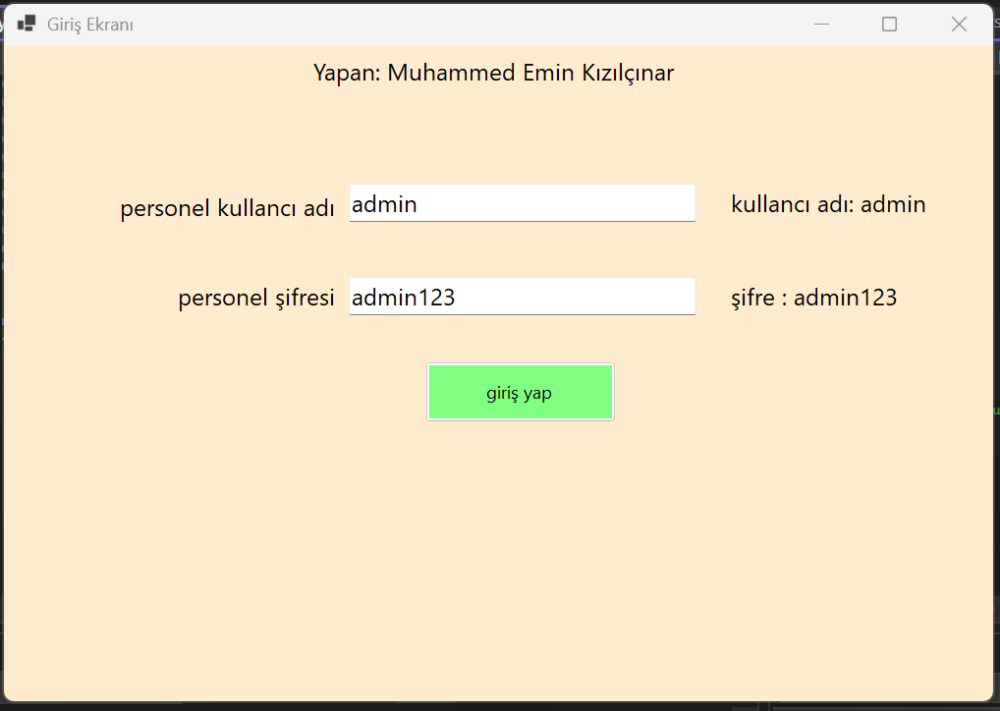
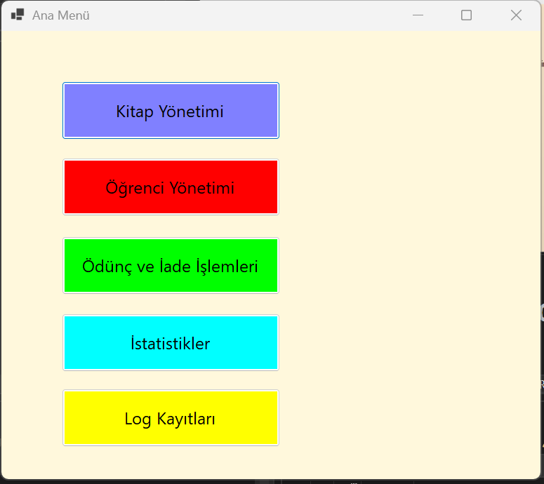
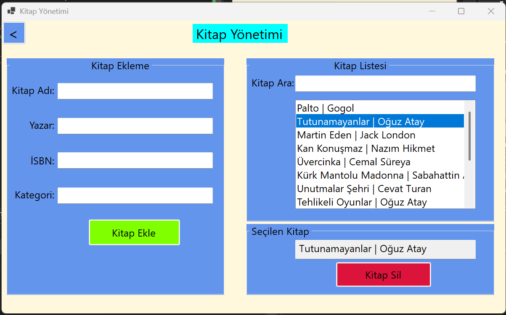
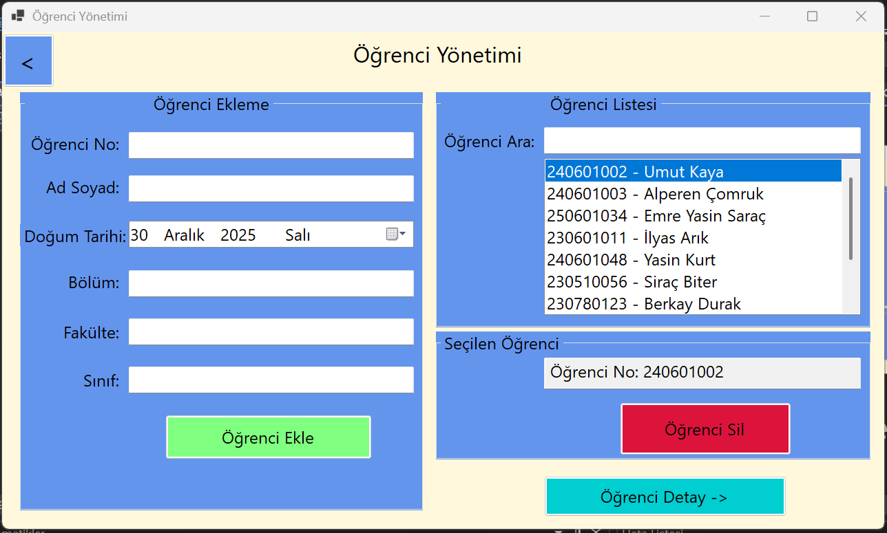
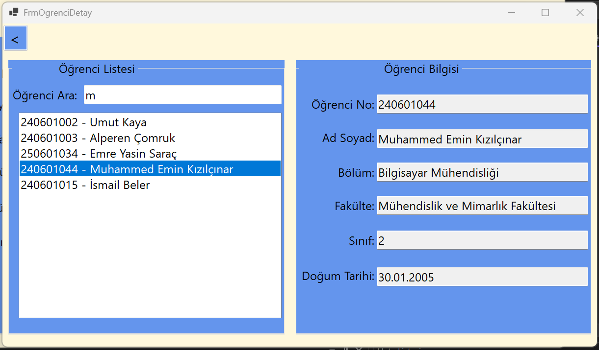
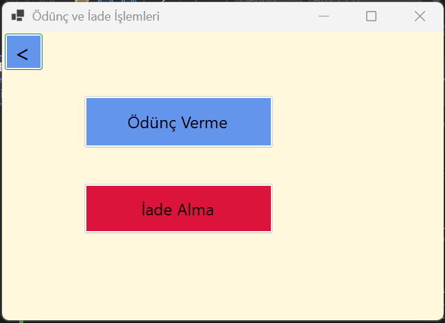
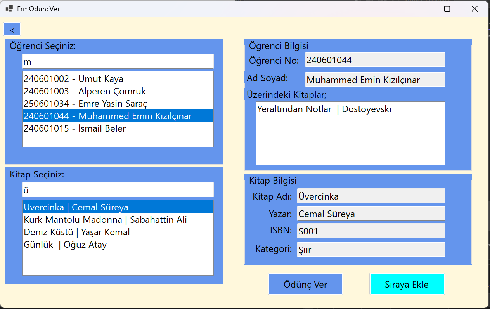
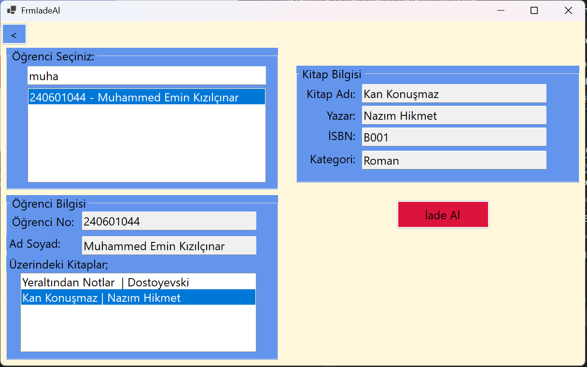
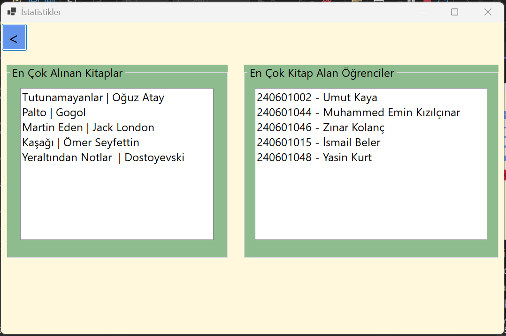
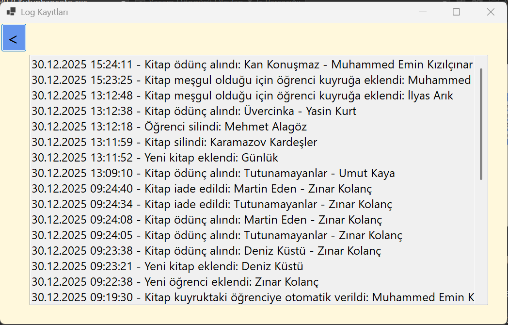

# Kütüphane Otomasyon Sistemi 
## Yapan: Muhammed Emin Kızılçınar
### Giriş Ekranı

Kullanıcı adı  ve şifre alınır. Doğruysa giriş yapar. Yanlışsa uyarı verir.
#
### Ana Menü

yapmak istediğimiz işlemlerin bulunduğu forma gemek için oluşturduğumuz ana menüdür. birine tıkladığımızda başka forma geçer.
#
### Kitap Yönetimi

Sol tarafta kitap ekleme kısmı bulunur. Kitap bilgileri girilir ve kitap ekle butonuna tıklayınca kitap eklenir.
Sağ tarafta silinecek kitap aratılır ve listede üstüne tıklanır. Tıklandığında kitap sağ alltaki seçilen kitap kısmında görünür. Sonra kitabı sil butonuna tıklayınca kitap silinir.
Kitaplar kendimizin yaptığı bağlı listede tutulur.
#
### Öğrenci Yönetimi

Solda öğrenci eklemek için öğrenci bilgileri alınır öğrenci ekle butonuna tıklayınca öğrenci eklenir.
Sağda öğrenci silmek için sağ üsteki listede arama yapılır sonra öğreniye tıklanır. Öğrencinin numarası sağ alta düşer öğrenci sil butonuna tıklayınca öğrenci silinir.
Sağ en altta öğrenci detay butonuna tıklayınca öğrencilerin detaylı bilgisine ulaşabileceğimiz bir form açılır.
Öğrenciler kendimizin yaptığı bağlı listede tutulur.
#
### Öğrenci Detay Formu

Solda bulunan listede öğrenci aranır. Listedeki öğrenciye tıklayınca sağda öğrencinin tüm bilgileri görünür.
Burda da öğrencileri tuttuğumuz bağlı liste kullanılmıştır.
#
### Ödünç ve İade 

Ödünç vermek ve iade alma işlemlerine geçmek için kullanılan formdur. butona tıklandığında ilgili forma geçer.
#
### Ödünç Verme Formu

Sol üstte öğrenci seçilir ve sağ üstte öğrenci no, ad soyad, üzerindeki kitaplar bilgileri görünür.
Sol altta kitap seçilir ve kitabın bilgileri sağ altta görünür. Ödünç ver butonuna tıklayınca kitap alınmamışsa kitap ödünç verilir. Bir öğrenci en fazla 3 kitap alabilir eğer 4. kitabı almaya çalışırsa massagebox ta uyarı verilir. Kitap ödünç alınmışsa massagebox kitabın alındığı söylenir. Bu durumda Öğrenci isterse kitap kuyruüuna girebilir. Sıraya ekle butonuna tıklayınca sıraya ekler ve sırası massagebox ta gösterilir.
Kitap iade edildiğinde otomatik olarak sıradaki kişiye ödünç verilir.
Öğrencilerin rezervasyon sırası kendi yaptığımız kuyruk veri yapısıyla yapılmıştır.
#
### İade Alma Formu

Sol üstte kitap ödünç alınacak öğrenci listede arama yapılır. Öğrenciye tıklandığında sol altta öğrencinin bilgileri ve üzerindeki kitaplar görünür.
Üzerindeki kitaplardan birine tıklayınca kitabın bilgileri sağ üstte görünür ve iade al butonuna tıklayınca kitap iade alınır.
Kitap iade alındığında kuyrukta bekleyen varsa otomatik olarak kitap sıradaki öğrenciye ödünç verilir.
#
### İstatistikler Formu

Sol tarafta en çok alınan 5 kitap listelenir. Sağ tarafta en çok kitap alan 5 öğrenci listelenir.
kendi yazdığımız sıralama algoritması kullanılmıştır.
#
### Log Kayıtları Formu

Kitap ekleme , kitap silme, öğrenci ekleme , öğrenci silme, kitap iade, kitap ödünç verme, kuyruğa ekleme gibi işlemler yapıldığında log kayıtları burada görünür.
Yapılan işlemlerin saati ve tarihi de log da görünür. En son yapılan işlem en üstte görünür.
İşlemi yapılan kişinin ya da kitabın bilgisi de log da görünür.
Kendi yaptığımız stack veri yapısı kullanılmıştır.

#### projeyi yapan: muhammed emin kızılçınar - 240601044